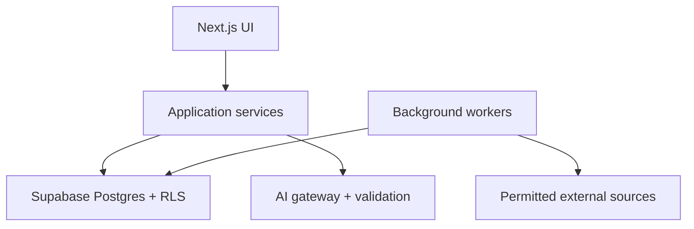

# Navlands MVP Architecture

Status: Implementation baseline  
Version: 0.3.0  
Date: 2026-07-11  
Authority: MOTHER.md and ALGORITHM.md

## 1. Architecture goals

- Preserve approved product behavior in domain services, not UI conditionals.
- Make ranking reproducible and recomputable.
- Treat AI and imported data as untrusted.
- Enforce user ownership in the database.
- Support global role aliases and location-aware market data.
- Keep graph rendering isolated and accessible.
- Permit background ingestion without blocking product requests.

## 2. Technology baseline

- Next.js App Router, React, strict TypeScript.
- shadcn components and Tailwind styling.
- React Flow in a focused client component.
- Supabase Auth, Postgres, RLS, Storage, and Realtime only where useful.
- Runtime schemas at every AI, import, API, and form boundary.
- Background workers/cron for imports, aggregates, freshness checks, and abuse
  flags.
- Email/password and Google OAuth through Supabase Auth.

No provider-specific AI dependency may leak into domain types.

## 3. Logical components



### 3.1 Web application

- Server components for authenticated reads where practical.
- Server actions/route handlers for commands.
- Client graph receives a bounded, already-authorized view model.
- Accessible list view renders the same view model.

### 3.2 Application services

Suggested boundaries:

- onboarding;
- canonical-role resolution;
- path retrieval;
- constraint evaluation;
- population ranking;
- display allocation;
- path publication and forking;
- AI generation/refinement;
- credits and reservations;
- voting and reports;
- source/provenance;
- moderation and deletion.

### 3.3 Background workers

- source acquisition and normalization;
- source freshness checks;
- salary data refresh;
- path vote aggregate recomputation;
- brigade quarantine evaluation;
- reciprocal-ring flagging after ten eligible votes;
- expired AI reservation recovery;
- dependent-path rebuild after source withdrawal;
- evaluation fixture runs.

### 3.4 Validation and delivery

- A single local full-validation command remains authoritative.
- GitHub Actions runs the same validation while its included free quota is
  available, with the spend ceiling set to zero.
- Cloudflare Workers/OpenNext is the free commercial CD candidate. A
  compatibility gate must prove required Next.js features before activation.
- Do not use a non-commercial hosting tier for Navlands production.
- Failed hosted validation never bypasses local release gates.

## 4. Domain boundaries

### 4.1 Canonical career graph

Navlands owns stable role IDs. Source IDs map through aliases and mappings.
Roles, source-backed transitions, and versioned source facts form the retrieval
graph. User paths reference canonical roles but preserve original titles.

### 4.2 User path graph

A path version is immutable after publication. Edits create versions. Forks
store origin path/version and node lineage. Deletion replaces origin access
with a tombstone rather than breaking graph references.

### 4.3 Recommendation snapshot

Each result stores the user context, source snapshot, factor values, vote
aggregate version, algorithm version, and reason codes used. The active view may
be recomputed explicitly but historical output remains explainable.

### 4.4 AI boundary

AI receives a minimized context packet and returns structured candidate data.
It cannot write paths, credits, scores, or sources directly. Application code
validates, classifies, scores, and commits.

## 5. Critical flows

### 5.1 Retrieval

```text
authorize -> load context -> normalize intent -> query populations
-> evaluate constraints -> rank within populations -> allocate display slots
-> persist recommendation snapshot -> return view model
```

### 5.2 AI generation

```text
authorize -> idempotency check -> reserve units -> assemble context
-> invoke model -> validate schema/domain -> classify origin
-> score deterministically -> persist path/version -> commit units
-> return one active AI path
```

Failure before valid persistence refunds the reservation.

### 5.3 Vote

```text
authorize -> rate-limit -> append vote event -> evaluate eligibility/quarantine
-> fold latest live votes -> write versioned aggregate -> invalidate rank cache
```

### 5.4 Source ingestion

```text
registry gate -> acquire permitted bytes/facts -> private raw snapshot if allowed
-> normalize -> deduplicate -> validate -> review full ladder
-> publish source version -> rebuild dependent graph
```

## 6. Transaction boundaries

Use database transactions or equivalent atomic functions for:

- credit reservation/commit/refund;
- vote event and current-vote projection;
- publication plus initial version;
- fork plus lineage;
- path deletion plus tombstone;
- source version activation;
- moderation quarantine.

Use idempotency keys for every retriable mutation and AI generation request.

## 7. Caching

Cache only version-addressed or safely invalidated data:

- canonical roles and aliases by taxonomy version;
- public path summaries by path version;
- population rankings by algorithm/context hash;
- source facts by source version.

Never cache an authorization decision across users. Vote/source changes either
bump the referenced version or invalidate dependent ranking caches.

## 8. Globalization

- Store money as amount, ISO currency, period, and gross/net semantics.
- Store locations using stable country/region/city identifiers and remote
  market semantics.
- Preserve localized titles as aliases.
- English UI first; database text fields allow future locale variants.
- Never convert salaries without recording exchange-rate source and date.

## 9. Observability

Use structured events with request/correlation IDs for:

- retrieval latency and result counts by population;
- exact versus nearest result;
- AI reservation, generation, validation, refund, and model cost;
- source import failures and stale records;
- vote quarantine and moderation;
- RLS denials and suspicious access;
- evaluation failures.

Do not log raw private responsibilities, salaries, family constraints, prompts,
or generated private paths.

## 10. Deployment environments

At minimum:

- local;
- preview/test;
- production.

Each uses separate Supabase projects or strictly separated databases, storage,
keys, webhook secrets, model credentials, and source snapshots. Production data
must never seed development.

India billing uses Razorpay behind a country feature flag. Non-India paid
checkout remains waitlisted/disabled until a global provider is approved. The
application must isolate provider adapters from plan entitlement logic so the
global provider can be enabled by feature flag rather than a product rewrite.

## 11. Migration and rollback

- All database changes use reviewed forward migrations.
- RLS policies ship with tests.
- Algorithm and prompt changes are version bumps.
- Source imports activate only after validation; previous versions remain
  addressable for rollback.
- Feature flags may disable Genie, publication, votes, Curated display, or a
  source independently.

## 12. Repository shape

Suggested, not binding until scaffolded:

```text
app/
components/
features/
domain/
server/
lib/
supabase/migrations/
workers/
tests/
docs/
```

Domain packages must not import React. React Flow-specific types stay at the UI
boundary.

## 13. Architecture gates before coding

1. Approve DATA-MODEL.md and AI-CONTRACTS.md.
2. Define actual package scripts and validation commands.
3. Create first Supabase schema and RLS threat tests.
4. Select the AI provider/model through cost and structured-output evaluation.
5. Create a source registry with at least O*NET and Wikidata permissions.
6. Create the first active milestone plan without calendar deadlines.
